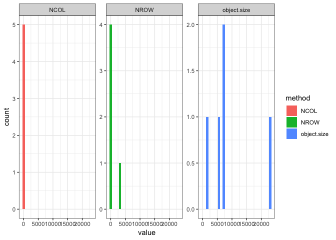

Results
================
Hao Ye
2019-04-26

## Read in the results

``` r
cache <- storr::storr_rds(".drake")

# find results objects
results_pattern <- "^results_"
cache_names <- cache$list()
results_names <- grep(results_pattern, cache_names, value = TRUE)

# load results
loadd(list = results_names)
```

## Process results together

Combine the outputs in each results object using `bind_rows()`, and wrap
this all together using `purrr::map_dfr()`:

``` r
full_results <- purrr::map_dfr(mget(results_names), bind_rows)

print(full_results)
```

    ##    value      method  dataset
    ## 1   7208 object.size   mtcars
    ## 2   7256 object.size     iris
    ## 3   1264 object.size     Nile
    ## 4  23024 object.size sunspots
    ## 5     11        NCOL   mtcars
    ## 6      5        NCOL     iris
    ## 7      1        NCOL     Nile
    ## 8      1        NCOL sunspots
    ## 9     32        NROW   mtcars
    ## 10   150        NROW     iris
    ## 11   100        NROW     Nile
    ## 12  2820        NROW sunspots

## Plot

For each level of `method`, produce a histogram for `value`:

``` r
ggplot(data = full_results, 
       mapping = aes(x = value, fill = method)) + 
    facet_wrap(~method, scales = "free_y") + 
    geom_histogram(position = "stack") + 
    theme_bw()
```

    ## `stat_bin()` using `bins = 30`. Pick better value with `binwidth`.

<!-- -->
